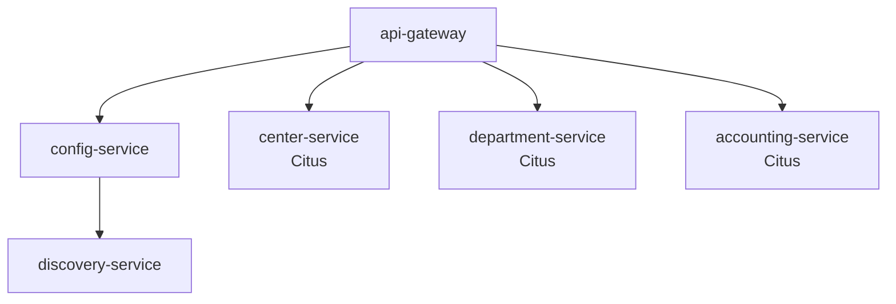

# ĐỀ TÀI MÔN CƠ SỞ DỮ LIỆU PHÂN TÁN

## Đề 2 (Điều chỉnh): QUẢN LÝ ĐIỂM SINH VIÊN THEO HỆ TÍN CHỈ (MÔ HÌNH LAI)

### Cơ sở dữ liệu QLDSV_HTC

#### a. Khoa

| FieldName | Type | Constraint |
|-----------|------|------------|
| MAKHOA | nChar(10) | Primary Key |
| TENKHOA | nVarchar(50) | Unique, not NULL |

#### b. Lop

| FieldName | Type | Constraint |
|-----------|------|------------|
| MALOP | nChar(10) | Primary Key |
| TENLOP | nVarchar(50) | Unique, not NULL |
| KHOAHOC | nchar(9) | not NULL |
| MAKHOA | nChar(10) | FK, not NULL |

#### c. Sinhvien

| FieldName | Type | Constraint |
|-----------|------|------------|
| MASV | nChar(10) | Primary key |
| HO | nVarchar(50) | not NULL |
| TEN | nVarchar(10) | not NULL |
| MALOP | nChar(10) | Foreign Key, not NULL |
| PHAI | Bit | Default: false (false: Nam; true: Nữ) |
| NGAYSINH | DateTime | |
| DIACHI | nVarchar(100) | |
| DANGHIHOC | Bit | Default: false |
| PASSWORD | nVarchar(40) | Default: '' |

#### d. Monhoc

| FieldName | Type | Constraint |
|-----------|------|------------|
| MAMH | nChar(10) | Primary key |
| TENMH | nVarchar(50) | Unique Key, not NULL |
| SOTIET_LT | int | not NULL |
| SOTIET_TH | int | not NULL |

#### e. Giangvien

| Field Name | Type | Constraint |
|------------|------|------------|
| MAGV | nChar(10) | Primary Key |
| HO | nvarchar(50) | not NULL |
| TEN | nvarchar(10) | not NULL |
| HOCVI | nvarchar(20) | |
| HOCHAM | nvarchar(20) | |
| CHUYENMON | nvarchar(50) | |
| MAKHOA | nCHAR(10) | FK, not NULL |

#### f. Loptinchi

| FieldName | Type | Constraint |
|-----------|------|------------|
| MALTC | int | Primary Key (tự động) |
| NIENKHOA | nChar(9) | not NULL |
| HOCKY | int | not NULL, 1 <=hocky<=4 |
| MAMH | nChar(10) | Foreign Key, not NULL |
| NHOM | int | not NULL, >=1 |
| MAGV | nChar(10) | Foreign Key, not NULL |
| MAKHOA | nChar(10) | Foreign Key, not NULL |
| SOSVTOITHIEU | SmallInt | not NULL, >0 |
| HUYLOP | bit | Default: false |
| | | Unique key: NIENKHOA + HOCKY + MAMH + NHOM |

MAKHOA: lớp tín chỉ do khoa nào quản lý

#### g. Dangky

| FieldName | Type | Constraint |
|-----------|------|------------|
| MALTC | int | Foreign Key, not NULL |
| MASV | nChar(10) | Foreign Key, not NULL |
| DIEM_CC | int | Điểm từ 0 đến 10 |
| DIEM_GK | float | Điểm từ 0 đến 10, làm tròn đến 0.5 |
| DIEM_CK | float | Điểm từ 0 đến 10, làm tròn đến 0.5 |
| HUYDANGKY | bit | Default: false |
| | | Primary key: MALTC + MASV |

#### h. HocPhi

| FieldName | Type | Constraint |
|-----------|------|------------|
| MASV | nChar(10) | Foreign Key, not NULL |
| NIENKHOA | nchar(9) | not NULL |
| HOCKY | Int | not NULL, 1 <=hocky<=4 |
| HOCPHI | Int | not NULL, >0 |
| | | Primary key: MASV + NIENKHOA + HOCKY |

#### i. CT_DongHocPhi

| FieldName | Type | Constraint |
|-----------|------|------------|
| MASV | nChar(10) | |
| NIENKHOA | nchar(9) | |
| HOCKY | Int | |
| NGAYDONG | Date | Default: GetDate() |
| SOTIENDONG | Int | not NULL, >0 |
| | | Primary key: MASV + NIENKHOA + HOCKY + NGAYDONG |

### Yêu cầu

Giả sử trường có 2 khoa: công nghệ thông tin (CNTT), và viễn thông (VT)

1. Phân tán cơ sở dữ liệu QLDSV_HTC theo mô hình lai (hybrid) như sau:
    - **SERVER_CENTER** (Server trung tâm): Chứa thông tin chung của toàn trường bao gồm các bảng KHOA, MONHOC, GIANGVIEN và thông tin quản lý người dùng.
    - **SERVER_CNTT** (Server khoa CNTT): Chứa thông tin về các lớp, sinh viên, lớp tín chỉ và đăng ký thuộc khoa công nghệ thông tin.
    - **SERVER_VT** (Server khoa VT): Chứa thông tin về các lớp, sinh viên, lớp tín chỉ và đăng ký thuộc khoa viễn thông.
    - **SERVER_PKT** (Server kế toán): Chứa thông tin đóng học phí của các sinh viên toàn trường.

### Mở rộng

- Có khả năng mở rộng cho nhiều khoa hơn.

**Lưu ý:**

- Lớp tín chỉ do khoa nào quản lý thì chỉ cho sinh viên khoa đó đăng ký.
- Một giảng viên có thể dạy các lớp tín chỉ thuộc cả 2 khoa, thông tin giảng viên được lưu tập trung ở server trung tâm và đồng bộ sang các server khoa.

### Phân bố dữ liệu chi tiết

#### SERVER_CENTER

- KHOA (toàn bộ)
- MONHOC (toàn bộ)
- GIANGVIEN (toàn bộ)
- Bảng quản lý người dùng và phân quyền

#### SERVER_CNTT

- LOP (chỉ lớp thuộc khoa CNTT)
- SINHVIEN (chỉ sinh viên thuộc khoa CNTT)
- LOPTINCHI (chỉ lớp tín chỉ do khoa CNTT quản lý)
- DANGKY (chỉ đăng ký của sinh viên khoa CNTT)
- Bản sao GIANGVIEN (đồng bộ từ SERVER_CENTER)
- Bản sao MONHOC (đồng bộ từ SERVER_CENTER)

#### SERVER_VT

- LOP (chỉ lớp thuộc khoa VT)
- SINHVIEN (chỉ sinh viên thuộc khoa VT)
- LOPTINCHI (chỉ lớp tín chỉ do khoa VT quản lý)
- DANGKY (chỉ đăng ký của sinh viên khoa VT)
- Bản sao GIANGVIEN (đồng bộ từ SERVER_CENTER)
- Bản sao MONHOC (đồng bộ từ SERVER_CENTER)

#### SERVER_PKT

- HOCPHI (toàn bộ)
- CT_DONGHOCPHI (toàn bộ)
- SINHVIEN_INFO (bảng chứa thông tin cơ bản của sinh viên: MASV, HO, TEN, MALOP, MAKHOA để phục vụ tra cứu)

Viết chương trình thực hiện các công việc sau:

### 2. Nhập liệu

- **Nhập danh mục lớp:** Form có các chức năng Thêm, Xóa, Ghi, Phục hồi, Thoát. Dữ liệu được lưu trên server khoa tương ứng và đồng bộ thông tin cơ bản sang SERVER_CENTER.
- **Nhập danh sách sinh viên:** Dưới dạng SubForm. Dữ liệu được lưu trên server khoa tương ứng và tự động đồng bộ thông tin cơ bản sang SERVER_PKT.
- **Nhập môn học:** Thêm, Xóa, Ghi, Phục hồi thông tin môn học trên SERVER_CENTER và tự động đồng bộ sang các server khoa.
- **Nhập thông tin giảng viên:** Thêm, Xóa, Ghi, Phục hồi thông tin giảng viên trên SERVER_CENTER và tự động đồng bộ sang các server khoa.
- **Mở lớp tín chỉ:** Thêm, Xóa, Ghi, Phục hồi thông tin lớp tín chỉ trên server khoa quản lý.
- **Đăng ký lớp tín chỉ:** User nhập mã sinh viên, chương trình hiển thị thông tin sinh viên và danh sách lớp tín chỉ để đăng ký. Thực hiện như một giao tác phân tán.
- **Nhập điểm:** User nhập Niên khóa, Học kỳ, môn học, nhóm; hiển thị danh sách sinh viên để nhập điểm. Tính điểm hết môn = Điểm CC *0.1 + Điểm GK* 0.3 + ĐCK * 0.6.
- **Đóng học phí:** Thực hiện trên SERVER_PKT, hiển thị thông tin học phí và chi tiết đóng học phí của sinh viên.

### 3. Phân quyền

Chương trình có các nhóm:

- **PGV (phòng giáo vụ)**: Có thể làm việc trên tất cả các server, chọn khoa để làm việc.
- **KHOA**: Chỉ làm việc trên server khoa tương ứng và SERVER_CENTER (chỉ đọc).
- **SV**: Đăng ký lớp tín chỉ, xem điểm của chính mình.
- **PKT (phòng kế toán)**: Chỉ làm việc trên SERVER_PKT, quản lý học phí.

### 4. In ấn

- **Danh sách lớp tín chỉ**: Liệt kê các lớp tín chỉ đã mở theo niên khóa, học kỳ.
- **Danh sách sinh viên đăng ký lớp tín chỉ**: Theo niên khóa, học kỳ, môn học, nhóm.
- **Bảng điểm môn học**: Của một lớp tín chỉ, theo thứ tự tăng dần tên+họ.
- **Phiếu điểm**: In phiếu điểm cho một sinh viên với điểm là điểm cao nhất của các lần thi.
- **Danh sách đóng học phí**: Theo mã lớp, niên khóa, học kỳ.
- **Bảng điểm tổng kết**: Dạng Cross-Tab theo mã lớp.

### 5. Yêu cầu kỹ thuật bổ sung

- Thiết kế cơ chế đồng bộ hóa dữ liệu giữa các server sử dụng trigger hoặc service broker.
- Xử lý giao tác phân tán đảm bảo tính nhất quán khi thao tác trên nhiều server.
- Cài đặt distributed view để tạo báo cáo tổng hợp từ nhiều server.
- Triển khai xác thực tập trung trên SERVER_CENTER và ủy quyền trên các server khác.
- Xử lý lỗi và phục hồi khi có sự cố trên một trong các server.

### Ghi chú

- Thực hiện việc truy vấn trên SQL Server.
- Chỉ làm việc với các sinh viên còn đang học.
- Đảm bảo tính nhất quán của dữ liệu trong môi trường phân tán.
- Tối ưu hiệu suất truy vấn trên từng server.

- Kiến trúc: Microservices
- Triển khai:
  - Môi trường dev: Docker Compose
  - Môi trường staging:
- Cơ sở dữ liệu: Citus

### Các Microservices Chính

1. **`academic-service` (Dịch vụ Học vụ Trung tâm):**

- **Trách nhiệm:** Quản lý thông tin chung toàn trường: KHOA, MONHOC, GIANGVIEN.
- **Database:** Sở hữu dữ liệu của các bảng KHOA, MONHOC, GIANGVIEN (tương ứng với SERVER_CENTER cũ, nhưng chỉ chứa dữ liệu này).
- **API:** Cung cấp API CRUD cho Khoa, Môn học, Giảng viên.
- **Events:** Phát ra các sự kiện (Events) khi có thay đổi dữ liệu (ví dụ: `MonHocCreated`, `GiangVienUpdated`) để các service khác có thể lắng nghe và cập nhật bản sao dữ liệu của mình nếu cần.

2. **`faculty-cnnt-service` (Dịch vụ Khoa CNTT):**

- **Trách nhiệm:** Quản lý thông tin riêng của khoa CNTT: LOP, SINHVIEN, LOPTINCHI, DANGKY.
- **Database:** Sở hữu dữ liệu LOP, SINHVIEN, LOPTINCHI, DANGKY chỉ thuộc khoa CNTT. Chứa bản sao (cache) chỉ đọc của MONHOC, GIANGVIEN liên quan (đồng bộ qua events từ `academic-service`).
- **API:** Cung cấp API CRUD cho Lớp, Sinh viên (CNTT), Lớp tín chỉ (CNTT), Đăng ký (CNTT), Nhập điểm (CNTT).
- **Events:** Phát ra các sự kiện như `StudentRegistered`, `GradeEntered`, `StudentCreated` (cho khoa CNTT).

3. **`faculty-vt-service` (Dịch vụ Khoa VT):**

- **Trách nhiệm:** Tương tự `faculty-cnnt-service` nhưng cho khoa Viễn Thông.
- **Database:** Sở hữu dữ liệu LOP, SINHVIEN, LOPTINCHI, DANGKY chỉ thuộc khoa VT. Chứa bản sao (cache) chỉ đọc của MONHOC, GIANGVIEN liên quan.
- **API:** Cung cấp API CRUD cho Lớp, Sinh viên (VT), Lớp tín chỉ (VT), Đăng ký (VT), Nhập điểm (VT).
- **Events:** Phát ra các sự kiện tương tự `faculty-cnnt-service` nhưng cho khoa VT.

4. **`tuition-service` (Dịch vụ Học phí - Kế toán):**

- **Trách nhiệm:** Quản lý thông tin học phí và chi tiết đóng học phí của *tất cả* sinh viên.
- **Database:** Sở hữu dữ liệu HOCPHI, CT_DONGHOCPHI. Chứa bản sao thông tin cơ bản của SINHVIEN (MASV, HO, TEN, MALOP, MAKHOA - đồng bộ qua events từ các `faculty-service`).
- **API:** Cung cấp API để tạo/cập nhật học phí phải đóng, ghi nhận tiền đóng học phí, truy vấn thông tin học phí.
- **Events:** Lắng nghe các sự kiện `StudentCreated`, `StudentUpdated` từ các `faculty-service` để cập nhật thông tin sinh viên cơ bản. Có thể phát ra sự kiện `TuitionPaid`.

5. **`auth-service` (Dịch vụ Xác thực & Phân quyền):**

- **Trách nhiệm:** Quản lý người dùng (tài khoản đăng nhập), vai trò (PGV, KHOA, SV, PKT), xác thực người dùng (login), cấp phát token (ví dụ: JWT).
- **Database:** Sở hữu dữ liệu người dùng, vai trò, quyền hạn.
- **API:** Cung cấp API để đăng nhập, đăng ký (nếu có), quản lý người dùng/vai trò, xác thực token.

6. **`api-gateway` (Cổng API):**

- **Trách nhiệm:** Là điểm vào duy nhất cho tất cả các yêu cầu từ client (Frontend/Mobile app). Định tuyến (route) yêu cầu đến microservice phù hợp. Xử lý các vấn đề xuyên suốt như xác thực token (gọi đến `auth-service`), rate limiting, logging, tổng hợp kết quả từ nhiều service (nếu cần).
- **Không có Database riêng.**

7. **`reporting-service` (Dịch vụ Báo cáo - Tùy chọn):**

- **Trách nhiệm:** Tổng hợp dữ liệu từ nhiều service khác để tạo ra các báo cáo phức tạp (ví dụ: Bảng điểm tổng kết Cross-Tab).
- **Database:** Có thể có CSDL riêng (Data Mart/Warehouse nhỏ) được cập nhật định kỳ hoặc bất đồng bộ từ các service khác thông qua events, hoặc truy vấn trực tiếp các service khác qua API (ít khuyến khích hơn cho báo cáo nặng).
- **API:** Cung cấp các API để tạo và lấy báo cáo.

### Cấu Trúc Distributed-Replication

Hệ thống này triển khai một cơ chế replication và high availability (HA) ở mức độ cơ bản, tập trung chủ yếu vào node điều phối (coordinator) và dựa vào khả năng phân tán dữ liệu của Citus cho các node thợ (worker).

#### Phân Mảnh Dữ Liệu (Sharding)

Trong hệ thống này, dữ liệu được phân mảnh (sharding) để tối ưu hóa khả năng mở rộng và hiệu suất xử lý. Các bảng lớn được phân mảnh dựa trên cột `faculty_code`, cho phép dữ liệu được phân phối đồng đều trên các node worker.

- **Bảng Phân Tán:** Các bảng như `class`, `student`, `credit_class`, và `registration` được phân mảnh theo `faculty_code`. Điều này giúp tối ưu hóa các truy vấn liên quan đến khoa và đảm bảo rằng dữ liệu liên quan được lưu trữ gần nhau trên cùng một node worker.

- **Bảng Tham chiếu:** Các bảng tham chiếu như `faculty`, `course`, `lecturer` là những bảng không phân mảnh, được sao chép lại trên tất cả các node worker.

- **Hàm Tạo Bảng Phân Tán:** Sử dụng hàm `create_distributed_table('table_name', 'distribution_column')` để tạo bảng phân tán. Ví dụ:
  - `class` và `student` được phân mảnh theo `faculty_code`, với `student` được đồng vị trí (colocated) với `class` để tối ưu hóa các phép JOIN.
  - `credit_class` và `registration` cũng được phân mảnh theo `faculty_code`, với `registration` được đồng vị trí với `student`.

### Công nghệ áp dụng dự kiến

- Chuyển sang dùng dotnet 9.0.

### Phân tích

**1. `academic-service` (Dịch vụ Học vụ Trung tâm)**

- **Dữ liệu sở hữu:** `faculty` (Khoa), `course` (Môn học), `lecturer` (Giảng viên).
- **Thao tác RUD:**
  - **Read:**
    - Lấy danh sách tất cả các Khoa.
    - Lấy thông tin chi tiết của một Khoa theo `faculty_code`.
    - Lấy danh sách tất cả các Môn học.
    - Lấy thông tin chi tiết của một Môn học theo `course_code`.
    - Lấy danh sách tất cả các Giảng viên (có thể lọc theo khoa).
    - Lấy thông tin chi tiết của một Giảng viên theo `lecturer_code`.
  - **Update:**
    - Cập nhật thông tin của một Khoa (ví dụ: đổi `faculty_name`).
    - Cập nhật thông tin của một Môn học (ví dụ: đổi `course_name`, `lecture_credits`, `lab_credits`).
    - Cập nhật thông tin của một Giảng viên (ví dụ: đổi họ tên, học vị, học hàm, chuyên môn, chuyển khoa `faculty_code`).
  - **Delete:**
    - Xóa một Môn học (cần kiểm tra ràng buộc, ví dụ: không có lớp tín chỉ nào đang mở).
    - Xóa một Giảng viên (cần kiểm tra ràng buộc, ví dụ: không được phân công dạy lớp tín chỉ nào).
- **Events phát ra:** `FacultyCreated`, `FacultyUpdated`, `FacultyDeleted`, `CourseCreated`, `CourseUpdated`, `CourseDeleted`, `LecturerCreated`, `LecturerUpdated`, `LecturerDeleted`.

**2. `faculty-cnnt-service` (Dịch vụ Khoa CNTT)** & **`faculty-vt-service` (Dịch vụ Khoa VT)**

- *(Logic tương tự cho cả hai, chỉ khác về dữ liệu cụ thể của khoa CNTT hoặc VT)*
- **Dữ liệu sở hữu:** `class` (Lớp học), `student` (Sinh viên), `credit_class` (Lớp tín chỉ), `registration` (Đăng ký).
- **Dữ liệu bản sao (Read-only):** `faculty`, `course`, `lecturer` (đồng bộ từ `academic-service`).
- **Thao tác CRUD (Dữ liệu sở hữu):**
  - **Create:**
    - Thêm một Lớp học mới (`class`) thuộc khoa.
    - Thêm một Sinh viên mới (`student`) vào một lớp học thuộc khoa.
    - Mở một Lớp tín chỉ mới (`credit_class`) do khoa quản lý (liên kết đến `course` và `lecturer` từ bản sao).
    - Tạo một Đăng ký mới (`registration`) cho sinh viên của khoa vào một lớp tín chỉ của khoa.
  - **Read:**
    - Lấy danh sách Lớp học của khoa (có thể lọc theo khóa học).
    - Lấy thông tin chi tiết một Lớp học theo `class_code`.
    - Lấy danh sách Sinh viên của khoa (có thể lọc theo lớp).
    - Lấy thông tin chi tiết một Sinh viên theo `student_code`.
    - Lấy danh sách Lớp tín chỉ đã mở của khoa (lọc theo niên khóa, học kỳ).
    - Lấy thông tin chi tiết một Lớp tín chỉ theo `credit_class_id`.
    - Lấy danh sách Sinh viên đã đăng ký một Lớp tín chỉ cụ thể (từ `registration`).
    - Lấy thông tin Đăng ký/Điểm của một Sinh viên trong một Lớp tín chỉ cụ thể.
    - Lấy danh sách các Lớp tín chỉ mà một Sinh viên đã/đang đăng ký.
    - Lấy điểm tổng kết/phiếu điểm của một Sinh viên.
  - **Update:**
    - Cập nhật thông tin Lớp học (`class`).
    - Cập nhật thông tin Sinh viên (`student`, ví dụ: địa chỉ, trạng thái nghỉ học `is_suspended=true`).
    - Cập nhật thông tin Lớp tín chỉ (`credit_class`, ví dụ: đánh dấu hủy lớp `is_cancelled=true`).
    - **Nhập/Cập nhật điểm** cho sinh viên trong bảng `registration` (`attendance_score`, `midterm_score`, `final_score`).
    - Cập nhật trạng thái Đăng ký (`registration`, ví dụ: đánh dấu hủy đăng ký `is_cancelled=true`).
  - **Delete:**
    - Xóa Lớp học (cần kiểm tra ràng buộc sinh viên).
    - Xóa Sinh viên (thường là đánh dấu `is_suspended=true` thay vì xóa cứng).
    - Xóa Lớp tín chỉ (nếu chưa có đăng ký hoặc đã hủy).
    - Xóa Đăng ký (ít dùng, thường là cập nhật `is_cancelled=true`).
- **Thao tác CRUD (Dữ liệu bản sao):** **Read Only.** Dùng để hiển thị thông tin liên quan (tên môn học, tên giảng viên khi xem lớp tín chỉ...).
- **Events phát ra:** `StudentCreated`, `StudentUpdated` (bao gồm cả khi `is_suspended` thay đổi), `GradeEntered`, `CreditClassCreated`, `CreditClassCancelled`, `RegistrationCreated`, `RegistrationCancelled`.

**3. `tuition-service` (Dịch vụ Học phí - Kế toán)**

- **Dữ liệu sở hữu:** `hocphi` (Học phí phải đóng), `ct_donghocphi` (Chi tiết đóng học phí).
- **Dữ liệu bản sao (Read-only):** `sinhvien_info` (Thông tin cơ bản: MASV, HoTen, MaLop, MaKhoa - đồng bộ từ các `faculty-service`).
- **Thao tác CRUD:**
  - **Create:**
    - Tạo bản ghi Học phí phải đóng (`hocphi`) cho một sinh viên theo niên khóa, học kỳ.
    - Ghi nhận một lần đóng học phí (`ct_donghocphi`) cho một sinh viên (liên kết với bản ghi `hocphi` tương ứng).
  - **Read:**
    - Lấy thông tin tổng hợp học phí (phải đóng, đã đóng, còn nợ) của một sinh viên theo niên khóa, học kỳ (từ `hocphi` và tổng hợp `ct_donghocphi`).
    - Lấy danh sách chi tiết các lần đã đóng học phí (`ct_donghocphi`) của một sinh viên cho một niên khóa, học kỳ.
    - Lấy danh sách sinh viên còn nợ học phí (có thể lọc theo lớp, niên khóa, học kỳ - cần join với `sinhvien_info`).
  - **Update:**
    - Cập nhật số tiền phải đóng trong `hocphi` (ví dụ: do điều chỉnh, miễn giảm - ít phổ biến).
    - Cập nhật thông tin một lần đóng học phí trong `ct_donghocphi` (ví dụ: sửa lỗi ghi nhận sai - rất ít khi xảy ra, cần quy trình chặt chẽ).
  - **Delete:**
    - Xóa một lần đóng học phí (`ct_donghocphi`) (rất hiếm, chỉ khi có sai sót nghiêm trọng và cần quy trình duyệt).
    - Xóa bản ghi học phí phải đóng (`hocphi`) (hiếm, có thể khi hủy toàn bộ học phí?).
- **Events lắng nghe:** `StudentCreated`, `StudentUpdated` từ các `faculty-service` để cập nhật `sinhvien_info`.
- **Events phát ra:** Có thể có `TuitionPaid` khi sinh viên hoàn thành đóng học phí cho một kỳ.

**4. `auth-service` (Dịch vụ Xác thực & Phân quyền)**

- **Dữ liệu sở hữu:** Người dùng (`users`), Vai trò (`roles`), Quyền hạn (`permissions`).
- **Thao tác CRUD:**
  - **Create:**
    - Tạo Người dùng mới (tài khoản đăng nhập).
    - Định nghĩa các Quyền hạn mới (nếu cần phân quyền chi tiết hơn vai trò).
    - Gán Vai trò cho Người dùng.
    - Gán Quyền hạn cho Vai trò.
  - **Read:**
    - Xác thực thông tin đăng nhập (kiểm tra username/password).
    - Lấy thông tin chi tiết Người dùng (bao gồm vai trò).
    - Lấy danh sách Người dùng (lọc theo vai trò...).
    - Lấy danh sách Vai trò.
    - Kiểm tra (validate) token JWT được cung cấp.
    - Lấy các quyền hạn của một người dùng/token.
  - **Update:**
    - Cập nhật thông tin Người dùng (đổi mật khẩu, email...).
    - Thay đổi Vai trò của Người dùng.
    - Thay đổi Quyền hạn của Vai trò.
  - **Delete:**
    - Xóa Người dùng.
    - Xóa Vai trò.
    - Thu hồi Quyền hạn khỏi Vai trò.
    - Thu hồi Vai trò khỏi Người dùng.

**5. `api-gateway` (Cổng API)**

- **Không sở hữu dữ liệu nghiệp vụ chính.**
- **Thao tác CRUD:** **Không trực tiếp.**
  - **Read:** Nhận yêu cầu từ client, xác thực token (bằng cách gọi `auth-service`), sau đó định tuyến yêu cầu (Create, Read, Update, Delete) đến service phù hợp. Có thể tổng hợp kết quả Read từ nhiều service.
  - **Write (Create, Update, Delete):** Nhận yêu cầu từ client, xác thực, định tuyến đến service phù hợp.

**6. `reporting-service` (Dịch vụ Báo cáo - Cân nhắc)**

- **Có thể sở hữu dữ liệu đã tổng hợp/chuẩn bị cho báo cáo (Data Mart/Warehouse nhỏ).**
- **Thao tác CRUD:**
  - **Create/Update/Delete (Internal):** Lắng nghe sự kiện từ các service khác hoặc định kỳ gọi API để cập nhật dữ liệu trong kho dữ liệu báo cáo riêng của mình.
  - **Read (API):** Cung cấp API để client yêu cầu và nhận các báo cáo đã được tạo (ví dụ: Danh sách lớp tín chỉ, Danh sách sinh viên đăng ký, Bảng điểm môn học, Phiếu điểm, DS đóng học phí, Bảng điểm tổng kết...). Các API này thực hiện truy vấn phức tạp trên dữ liệu đã tổng hợp hoặc gọi API các service khác để lấy dữ liệu tức thời (ít khuyến khích cho báo cáo nặng).
